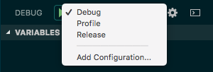

# 02 - Global Launch Configurations (in VS Code)

In VS Code, a Flutter app can easily be ran in debug mode on a device by pressing **F5**. However, what about release or profile mode?

In Debug View (CMD + SHIFT + D), you may notice that no launch configurations have been set up:


By either clicking on the "No Configurations" dropdown and selecting "Add Configuration", or simply clicking on the gear icon right of the dropdown, a *launch.json* file will automatically be created and opened.

```
{
    "version": "0.2.0",
    "configurations": [
        {
            "name": "Flutter",
            "request": "launch",
            "type": "dart"
        }
    ]
}
```

Although this defaults to debug mode, by supplying a value for the key *flutterMode*, we can specify either debug, profile or release mode:

```
{
    "version": "0.2.0",
    "configurations": [
        {
            "name": "Debug",
            "request": "launch",
            "type": "dart",
            "flutterMode": "debug"
        },
        {
        "name": "Profile",
            "request": "launch",
            "type": "dart",
            "flutterMode": "profile"
        },
        {
            "name": "Release",
            "request": "launch",
            "type": "dart",
            "flutterMode": "release"
        }
    ],
}
```

Now we can select these profiles from the dropdown mentioned above, and when F5 is pressed, the corresponding launch mode will be used.



This file, however, is saved to *{PROJECT ROOT}/.vscode/launch.json*, which ignored by Flutter's gitignore. Moreover, these profiles aren't something that need to change between projects, while I do not feel like re-creating them for each project I work on.

One approach is to define global launch settings which will be visible throughout all workspaces in VS Code. Open the *Command Palette* (CMD + SHIFT + P), type "Settings json" and select **Preferences: Open Settings (JSON)**.


Here we can define our Flutter configurations to be global:

```
// Global debug launch configuration. Should be used as an alternative to 'launch.json' that is shared across workspaces.
"launch": {
    // Flutter configurations
    "configurations": [
        {
            "name": "Debug",
            "request": "launch",
            "type": "dart",
            "flutterMode": "debug"
        },
        {
            "name": "Profile",
            "request": "launch",
            "type": "dart",
            "flutterMode": "profile"
        },
        {
            "name": "Release",
            "request": "launch",
            "type": "dart",
            "flutterMode": "release"
        }
    ],
    "compounds": []
},
```

## References

[Dart Code - Running Flutter Apps in Profile or Release Modes](https://dartcode.org/docs/running-flutter-apps-in-profile-or-release-modes/)
