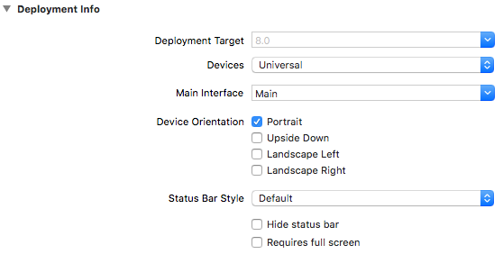

# 03 - Specify Device Orientation

By default, *Portrait*, *Landscape Left* and *Landscape Right* orientations are supported when a Flutter project is created. If you would like to specify the supported orientations for the duration of an app's lifecycle, this can easily be achieved in one of two ways.

### 1. Set in main()

The simplest approach is to set the orientations using *setPreferredOrientations* of **SystemChrome**:

```dart
import 'package:flutter/services.dart';

void main() async {
    await SystemChrome.setPreferredOrientations([DeviceOrientation.portraitUp]);
    runApp(MyApp());
}
```

Note that, as *setPreferredOrientations* returns a future, we need to wait on its result before running the app.

### 2. Manually Set in Android & iOS Project Settings

However, as the supported device orientation(s) isn't something that need to changed often, I prefer to actually set this value in the Android and iOS project settings.

For iOS, open *ios/Runner.xcworkspace* and check the orientations you'd like to support:



For Android, open *android/app/src/main/AndroidManifest.xml* and add the activity element attribute *android:screenOrientation*:

```xml
<manifest xmlns:android="http://schemas.android.com/apk/res/android"
    package="com.defuncart.helloworld">

    <application
        android:name="io.flutter.app.FlutterApplication"
        android:label="Hello World"
        android:icon="@mipmap/ic_launcher">
        <activity
            android:name=".MainActivity"
            android:screenOrientation="portrait"

            ....
```
