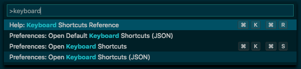

# 06 - Device Screen Capture

If a picture is worth a thousand words, then a video can be practically priceless in demonstration an app's feature to colleagues, clients etc. Lets find out how to capture videos from mobile devices.

## iOS

A screen capture can easily be recorded on an iOS device itself using either the record button in Control Center with the resulting video saved to Photos, or by connecting a device to a Mac and recording through *Quicktime*. How about the iOS Simulator itself?

When using the iOS Simulator, a screenshot can be taken using **CMD + S** (or going to *File* -> *New Screen Shot*). What is not obvious, is that a screen capture of the simulator can also be taken. With the iOS Simulator running, open up a Terminal and run the following command:

```
xcrun simctl io booted recordVideo ~/Desktop/screencapture.mov
```

To stop recording, simply press **CTRL + C**.

Although this isn't necessarily a very long command, it isn't something that I want to repeatedly type. As there is an integrated Terminal inside VS Code, we can add a shortcut for a custom action. Open the *Command Palette* (**CMD + SHIFT + P**), type "keyboard" and select *Preferences: Open Keyboard Shortcuts (JSON)* (to begin editing *~Library/Application Support/Code/User/keybindings.json*)



Then copy and paste the following key binding:

```json
{
    "key": "shift+cmd+1",
    "command": "workbench.action.terminal.sendSequence",
    "args": {
        "text": "xcrun simctl io booted recordVideo ~/Desktop/screencapture.mov\u000D"
    },
    "when": "terminalFocus && !terminalTextSelected"
}
```

Once the Terminal is focused (and no text is selected), by pressing **CMD + SHIFT + 1**, the screen capture command will be sent to the terminal and automatically executed (\u000D is the ascii code for return).

Note that the frame rate can be choppy (depending on the Mac's hardware), but it suffices my need of capturing videos to create gifs. If you find the output to be unusable, you can always simply make a screen capture using *QuickTime Player*. For creating App Preview videos, I would err on the side of using a real device, [as advised by Apple](https://developer.apple.com/support/app-previews/imovie/).

By the way, a screenshot can be taken using the following command:

```
xcrun simctl io booted screenshot ~/Desktop/screenshot.png
```

## Android

I never use the Android Emulator, instead preferring to run on a real device, however as far as I know, there is no way to capture video from the emulator. Using *adb*, a screen grab can be recorded to a device and then transferred over to a local machine.

Firstly, install a release build onto the device to ensure faster performance over debug builds. Then open up a Terminal and run the following command:

```
adb shell screenrecord /sdcard/screencapture.mp4
```

To stop recording, simply press **CTRL + C**. To transfer this video to your machine, run this command:

```
adb pull /sdcard/screencapture.mp4 ~/Desktop/screencapture.mp4
```

As before, these commands can be added as custom key bindings: 

```json
{
    "key": "shift+cmd+2",
    "command": "workbench.action.terminal.sendSequence",
    "args": {
        "text": "adb shell screenrecord /sdcard/screencapture.mp4\u000D"
    },
    "when": "terminalFocus && !terminalTextSelected"
},
{
    "key": "shift+alt+2",
    "command": "workbench.action.terminal.sendSequence",
    "args": {
        "text": "adb pull /sdcard/screencapture.mp4 ~/Desktop/screencapture.mp4\u000D"
    },
    "when": "terminalFocus && !terminalTextSelected"
}
```
