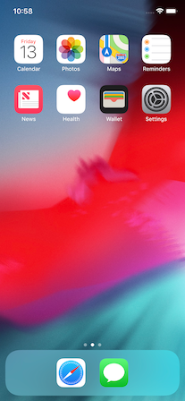
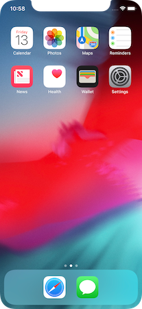

# 07 - iPhone X Simulator Screenshots

In the [last tip](https://github.com/defuncart/flutter-tips-tricks/tree/master/06-DeviceScreenCapture), I mentioned that iOS Simulator screenshots and screen captures can be taking using the terminal commands

```
xcrun simctl io booted screenshot ~/Desktop/screenshot.png
```

and

```
xcrun simctl io booted recordVideo ~/Desktop/screencapture.mov
```

respectively.

With regard to iPhoneX and other iPhones with a notch, the option ```--mask``` can be very useful:

- ```ignored``` applies no mask, thus a fully rendered image with no corner or notch markings. This is the default value.
- ```alpha``` applies an alpha mask with the corners and notch rendered transparent.
- ```black``` applies a black mask with the corners and notch rendered black.

```
xcrun simctl io booted screenshot --mask alpha ~/Desktop/screenshot.png
```

| ```ignored```    | ```alpha```      | ```black```      |
|:----------------:|:----------------:|:----------------:|
||||

Similarly, a screen capture can be taken using

```
xcrun simctl io booted recordVideo --mask black ~/Desktop/screencapture.mov
```

however only ```ignored``` and ```black``` are valid values.

Note that other image and video file formats are supported, ```png```, ```tiff```, ```bmp```, ```gif``` and ```jpeg``` for images and ```h264```, ```mp4``` and ```fmp4``` for videos, defaulting to ```png``` and ```mp4``` respectively.
