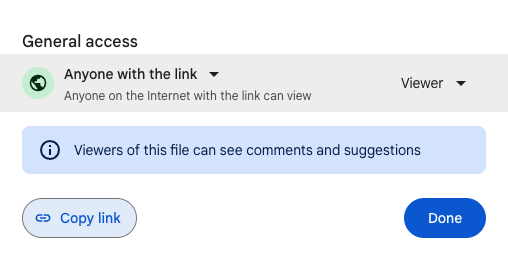

# 10 - Generate Localization Delegates from Google Drive

Flutter natively uses ARB files in order to generate localization delegates (for an overview please see [documentation](https://docs.flutter.dev/accessibility-and-localization/internationalization)). Although these files are practical with working with professional translators, Spreadsheets or CSV files can sometimes be more practical for small projects or MVPs.

[arb_generator](https://pub.dev/packages/arb_generator) is a dart tool which generates ARB files from CSV files. Although this package does not support an integration with Google Drive, by using public links and some scripting, localization delegates can easily be generated.

## CSV File store on Google Drive

Given a CSV file stored on google drive, ensure that the file can be publicly viewed by setting the access level to 'Anyone with the link':



Click on 'Copy link' to copy the link to your clipboard. The link should be of the form 

```
https://drive.google.com/file/d/<FILE_ID>/view?usp=sharing"
```

Note the file's id. 

Now in our Flutter project, add a bash script which will download the csv file, and then use `arb_generator` to generate ARB files:

```sh
FILE_ID="<FILE_ID>"
DOWNLOAD_URL="https://drive.google.com/uc?export=download&id=$FILE_ID"

# download csv
curl -L $DOWNLOAD_URL > assets_dev/test.csv

# generate arb files
flutter pub run arb_generator
```

Running this script in the terminal will generate ARB files from the downloaded CSV files. The localization delegates can then be generated using [intl](https://docs.flutter.dev/development/accessibility-and-localization/internationalization#adding-your-own-localized-messages) or [intl_utils](https://pub.dev/packages/intl_utils). For more information, please see `arb_generator`'s [documentation](https://pub.dev/packages/arb_generator#getting-started).

## Google Spreadsheet

What if the localizations are stored in a Google Spreadsheet? Google Drive offers downloading spreadsheets as CSV files so a similar approach can be used.

Ensure that the spreadsheet can be publicly viewed by setting the access level to 'Anyone with the link' and note the document's id either by using 'Copy link' or opening the spreadsheet in the browser. The link should be of the form:

```
https://docs.google.com/spreadsheets/d/<DOCUMENT_ID>
```

Note the document's id. 

As before, let's add a script to the flutter project:

```sh
DOCUMENT_ID="<DOCUMENT_ID>"
DOWNLOAD_URL="https://docs.google.com/spreadsheets/d/$DOCUMENT_ID/export?format=csv"

# download csv
curl -L $DOWNLOAD_URL > assets_dev/test.csv

# generate arb files
flutter pub run arb_generator
```

Similarly, the delegates can be generated as mentioned above.
