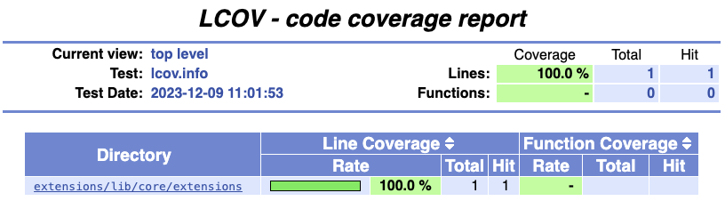
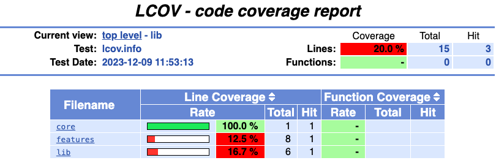
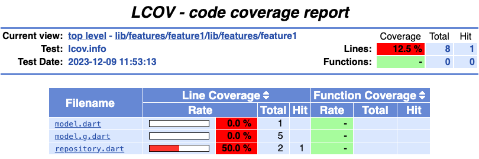
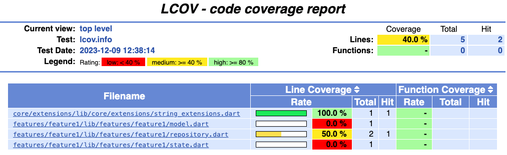
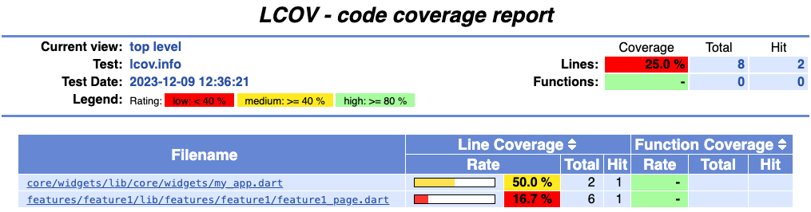

# 12 - Test Coverage Report

*Code Coverage* is a metric denoting how much of a codebase is tested. A *Test Coverage Report* is a human readable report detailing the percentage of code coverage of a project. 

It should be noted that *Code Coverage* can be a misleading metric as it only measures percentage of lines coverage, and not percentage of logical flow sequences.

## lcov

Running `flutter test --coverage` will generate `coverage/lcov.info`. Using `lcov` (`brew install lcov`), a HTML report can be created using `genhtml`.

<table>
<tr>
<td> 

`lcov.info`

</td>
<td>

**HTML Report**

</td>
</tr>
<tr>
<td>

```lcov
SF:lib/core/extensions/string_extensions.dart
DA:2,2
LF:1
LH:1
end_of_record
```

</td>
<td>



</td>
</tr>
</tr>
</table>

Note that `genhtml` has an extensive set of options, here are some examples:

<table>
<tr><td>--legend</td><td>Include color legend in HTML output</td></tr>
<tr><td>--hierarchical</td><td>Generate multilevel HTML report, matching source code directory structure</td></tr>
<tr><td>--flat</td><td>Generate flat HTML report, with all files listed on top-level page</td></tr>
<tr><td>-rc genhtml_hi_limit</td><td>High limit to be denoted green (i.e. good coverage)</td></tr>
</table>

See `genhtml -h` for more info. 

## Ensure All Files are Covered

Looking at the report above, it seems that our project has 100% code coverage. However, `--coverage` will only report coverage for files which are directly tested, or classes used by tested classes. This is a [known issue](https://github.com/flutter/flutter/issues/27997), with the solution to generate a helper file containing an empty main with all files from `lib` imported. This can be achieved using a script such as:

```sh
#!/bin/sh
file=test/coverage_helper_test.dart
printf "// Helper file to make coverage work for all dart files\n" > $file
printf "// **************************************************************************\n" >> $file
printf "// Because of this: https://github.com/flutter/flutter/issues/27997#issue-410722816\n" >> $file
printf "// DO NOT EDIT THIS FILE USE: sh scripts/import_files_coverage.sh YOUR_PACKAGE_NAME\n" >> $file
printf "// **************************************************************************\n" >> $file
printf "\n" >> $file
printf "// ignore_for_file: unused_import\n" >> $file
find lib -type f \( -iname "*.dart" ! -iname "*.g.dart" ! -iname "*.freezed.dart" ! -iname "generated_plugin_registrant.dart" \) | cut -c4- | awk -v package="$1" '{printf "import '\''package:%s%s'\'';\n", package, $1}' >> $file
printf "\nvoid main(){}" >> $file
```

or by using packages such as [full_coverage](https://pub.dev/packages/full_coverage) or [dart_code_coverage](https://github.com/defuncart/dart_code_coverage)

<table>
<tr>
<td></td>
<td></td>
</tr>
</table>

Now all files are part of the report, however the final coverage percentage can still be tweaked.

## Remove Generated Files

Code generation libraries such as *freezed* and *json_serializable* are great to help automatically generate equality and useful functions such as `copyWith`, `toJson`, however we don't want to include this code in generated reports. Using `lcov --remove`, files can be removed via pattern:

```sh
lcov --remove coverage/lcov.info 'lib/**.g.dart' 'lib/**.freezed.dart' -o coverage/lcov.info
```

Alternatively, packages such as [remove_from_coverage](https://pub.dev/packages/remove_from_coverage) or [dart_code_coverage](https://github.com/defuncart/dart_code_coverage) can be used.

Depending on your project, you may also need to ignore other generated code. If, for instance, the projects contains some dev mode code which you'd like to also remove, you can simply annotate the relevant files with `coverage:ignore-file`:

```dart
// coverage:ignore-file

class DevPanel {}
```

## Final Script

Putting it all together, the following script will generate a HTML report of your project's code coverage:

```sh
# remove existing coverage
rm -rf coverage

# ensure all files in lib are considered in coverage report
sh bin/generate_coverage_helper.sh PROJECT_NAME

# generate lcov report
flutter test --coverage

# remove generated files
lcov --remove coverage/lcov.info 'lib/**.g.dart' 'lib/**.freezed.dart' -o coverage/lcov.info

# generate html report
genhtml coverage/lcov.info -o coverage/html --rc genhtml_hi_limit=80 --rc genhtml_med_limit=40 --legend
```

This report can be opened using `open coverage/html/index.html` and could be uploaded to a hosting platform or third-part solution such as [codecov](https://about.codecov.io/).

## Specific Reports

Depending on the business need, it may be advantageous to generate a report listing only, for instance, the business logic.

When your code base is consistently named, this can be achieved by combining `find` and `lcov --remove`:

```sh
ALL_FILES=(`find lib -type f -name "*.dart"`)
TARGET_FILES=(`find lib -type f \( -iwholename *state* -o -iwholename *repository* -o -iwholename *model* -o -iwholename *extension* \)`)
for file in "${ALL_FILES[@]}"; do
    if [[ ! " ${TARGET_FILES[*]} " =~ " ${file} " ]]; then
        lcov --remove coverage/lcov.info "$file" -o coverage/lcov.info
    fi
done
```

*NOTE*: depending on how `lib` is structured, you may prefer to use `name` (file name i.e. `state.dart`) over `wholename` (relative path i.e. `lib/features/feature1/state.dart`). To ignore case, use `iname` and `iwholename`.

Here is the full script:

```sh
OPTION=$1

print_valid_options () {
    echo "bl - Generate reports for all business logic (default)"
    echo "ui - Generate reports for all ui"
}

SEARCH_TERM='-iwholename *state* -o -iwholename *repository* -o -iwholename *model* -o -iwholename *extension*'
if [ "$OPTION" = "bl" ]; then
    echo "Generating report for business logic"
elif [ "$OPTION" = "ui" ]; then
    echo "Generating report for ui"
    SEARCH_TERM='-iwholename *widget* -o -iwholename *page*'
elif [ -n "$OPTION" ]; then
    echo "$OPTION is an invalid option. The following options are available:"
    print_valid_options
    echo "Resorting to default option."
else
    echo "No option given."
    print_valid_options
    echo "Resorting to default option."
fi

# remove existing coverage
rm -rf coverage

# ensure all files in lib are considered in coverage report
sh bin/generate_coverage_helper.sh PROJECT_NAME

# generate lcov report
fvm flutter test --coverage

# remove generated files
lcov --remove coverage/lcov.info 'lib/**.g.dart' 'lib/**.freezed.dart' -o coverage/lcov.info

# remove non-applicable files
ALL_FILES=(`find lib -type f -name "*.dart"`)
TARGET_FILES=(`find lib -type f \( $SEARCH_TERM \)`)
for file in "${ALL_FILES[@]}"; do
    if [[ ! " ${TARGET_FILES[*]} " =~ " ${file} " ]]; then
        lcov --remove coverage/lcov.info "$file" -o coverage/lcov.info
    fi
done

# generate html report
genhtml coverage/lcov.info -o coverage/html --rc genhtml_hi_limit=80 --rc genhtml_med_limit=40 --legend --flat
```

<table>
<tr>
<td></td>
<td></td>
</tr>
</table>

