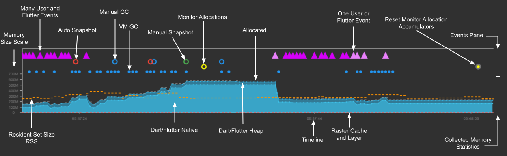
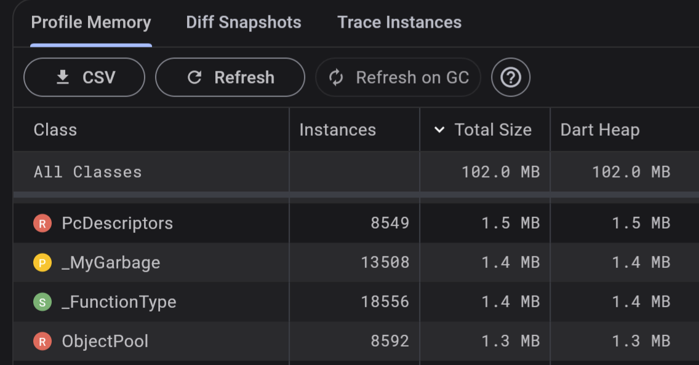
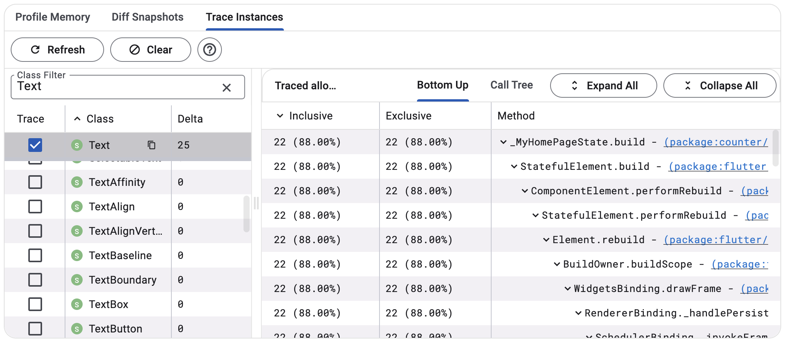

# 17 - Flutter Web Memory Leaks

A memory leak occurs when an application continues to use memory that it no longer needs instead of releasing it back to the operating system. Over time, unreleased memory chunks accumulate, leading to increased memory usage, slower performance and can even potentially crash the application with out of memory exceptions.

## Common Causes

The Dart Garbage Collector (GC) automatically frees memory that is no longer referenced. A memory leak occurs when objects are still referenced, even if they aren't actually needed. Some common causes include:
- Not disposing `Disposable` objects. `dispose` should be called for controllers (`TextEditingController`, `AnimationController`), `FocusNode`s etc.
- Non-needed objects are stored as global or static variables.
- `BuildContext` passed to another class, outliving the `Widget` it originated from and stopping the collection of said widget.
- Anonymous Closure Functions holding references to non-needed objects.
- Not cancelling Cancellable objects i.e. `Timer` etc.

## Development Phrase

Detection and prevention of memory leaks during development can drastically reduce costs compared to hotfixing production releases.  

### Linting

Potential leaks can be caught during development with the help of static analysis. Linting rules such as [`cancel_subscriptions`](https://dart.dev/tools/linter-rules/cancel_subscriptions), [`close_sinks`](https://dart.dev/tools/linter-rules/close_sinks) can be added to `analysis_options.yaml`, and when code violates these rules, `flutter analyze` will return errors.

Additionally, [Dart Code Metrics](https://dcm.dev/) (DCM) offers rules such as [`always-remove-listener`](https://dcm.dev/docs/rules/flutter/always-remove-listener/), [`dispose-fields`](https://dcm.dev/docs/rules/flutter/dispose-fields/), [`dispose-class-fields`](https://dcm.dev/docs/rules/common/dispose-class-fields/), [`avoid-undisposed-instances`](https://dcm.dev/docs/rules/flutter/avoid-undisposed-instances/) and [`avoid-unassigned-stream-subscriptions`](https://dcm.dev/docs/rules/common/avoid-unassigned-stream-subscriptions/).

### Tracking Leaks 

The experimental package [`leak_tracker`](https://pub.dev/packages/leak_tracker) can be used to get an overview of how many potential memory leaks an application has. Once integrated, warnings will be printed to the console:

```
leak_tracker: 134 memory leak(s): not disposed: 134, not GCed: 0, GCed late: 0
```

If your project has unit and widget tests, [`leak_tracker_flutter_testing`](https://pub.dev/packages/leak_tracker_flutter_testing) will automatically fail tests where leaks are observed.

## Testing Phase

### Dart DevTools

Dart DevTools offers a Memory View with 
- Expandable chart: Real-time visualization of memory usage
- Profile: Display current memory usage 
- Diff Snapshots: Monitor memory changes over time
- Trace: Determine what methods allocate memory for what classes

| Expandable chart  | Profile           | Diff Snapshot     | Trace             |
|-------------------|-------------------|-------------------|-------------------|
|  |  |  |  |

All images are courtesy of Flutter documentation.

Such tools are invaluable to determining what objects are leaking. However, this tool, along with others such as [Performance View](https://docs.flutter.dev/tools/devtools/performance) are not available for Web.

### Chrome DevTools

Flutter for Web does not generate HTML DOM elements like most web frameworks, instead rendering to a canvas<sup>1</sup>. Although this avoids inconsistencies across browsers and improves animation performance etc., it means that tools such as Chrome DevTools cannot meaningfully inspect the HTML output.

Moreover, Chrome DevTools can only see the JS output, the connection to source Dart code is lost. This means that there is no direct mapping to Dart objects/Flutter widgets, no ability to trigger the Dart GC while the lifecycle of objects may not be in sync.

<sup>1</sup>Previously Flutter offered the HTML Renderer for web, however this has been [deprecated and removed](https://github.com/flutter/flutter/issues/145954).

## Adding Native Targets to Enable Profiling

For Flutter Web only projects, it is advantageous to add a native target such as Android, iOS, Linux, macOS or Windows in order to enable memory and performance profiling. To determine if all project dependencies support your chosen target, you can look through the packages on [pub.dev](https://pub.dev/) or use an extension for VSCode such as [Flutter Dependency Platform Checker](https://marketplace.visualstudio.com/items?itemName=shaalan.flutter-dependency-platform-checker).

Native targets cannot be compiled with dependency web-specific apis such as `dart:html`, `dart:js` etc. Instead, this code can be hidden behind conditional imports:

```dart
// feature.dart
export 'feature_unsupported.dart'
    if (dart.library.js) 'feature_web.dart'
    if (dart.library.io) 'feature_native.dart';

// feature_unsupported.dart
void doSomething() => throw UnsupportedError('Platform not supported');

// feature_native.dart
void doSomething() {}

// feature_web.dart
import 'dart:js';

void doSomething() {
  var object = JsObject(context['Object']);
}
```

## Resources

[Dart DevTool: Memory View](https://docs.flutter.dev/tools/devtools/memory)

[Dive into DevTools](https://www.youtube.com/watch?v=_EYk-E29edo)

[See leaks in a running application (experimental)](https://github.com/dart-lang/leak_tracker/blob/main/doc/leak_tracking/DETECT.md#see-leaks-in-a-running-application-experimental)

[Chrome DevTools](https://developer.chrome.com/docs/devtools/memory-problems)