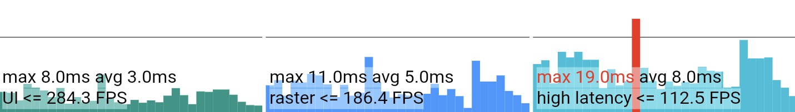

# 19 - Flutter Web Performance Overlay

The suite of [Dart DevTools](https://docs.flutter.dev/tools/devtools) are not available on for Flutter Web. Luckily, the [performance](https://pub.dev/packages/performance) package can be integrated to display a performance overlay.



Simply wrap the app's child in the overlay:

```dart
return MaterialApp(
    home: Page1(),
    builder: (context, child) => CustomPerformanceOverlay(
        child: child ?? const SizedBox.shrink(),
    ),
);
```

or, depending on navigation setup, wrap `MaterialApp` itself.

The overlay can be disabled when the app isn't in profile mode using `enabled: kIsWeb && kProfileMode`, or alternatively inject a variable via dart defines.

## Additional Settings

I recommend setting `backgroundColor: Colors.transparent` so that background will be transparent and UI elements still visible within. Moreover, wrap `CustomPerformanceOverlay` in `IgnorePointer` to ensure that all UI elements below it can be interacted with. Additionally, a simple `IconButton` can be added to toggle visibility.
