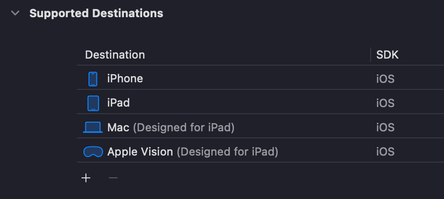
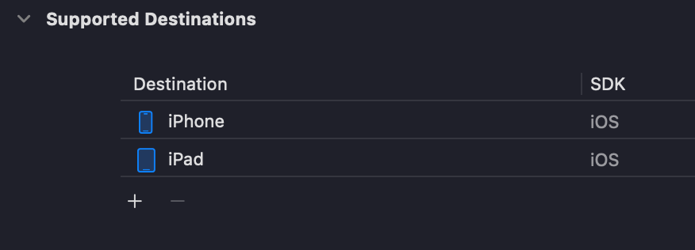
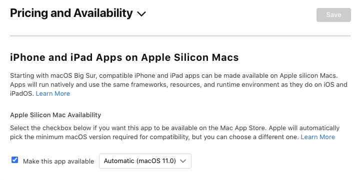

# 23 Remove Mac as Supported Destination for iOS/iPadOS Apps

When you create a new Flutter project with iOS support, or even a native iOS app via Xcode, by default both Mac and Apple Vision will be selected as supported destinations.

"Designed for iPhone" and "Designed for iPad" refers to iOS and iPadOS apps that can run natively on Macs with Apple silicon (M-series chips) and the recent Apple Vision Mixed AR headset.

As App Store and Mac App Store use the same developer account, when "Designed for iPad" is enabled, apps released on the iOS App Store will also automatically be available on the Mac App Store.

If you are looking to quickly port your application to macOS, this is a simple approach compared to the overhead of creating a Mac Catalyst app. However, the application will behave like it would on an iPad — it is not a true native macOS app.

## Remove Support

To remove "Designed for iPad" macOS support, open Xcode, select the destination list and click the minus (-) button next to Mac or Vision.

If your app was previously published, you'll also need to uncheck the following option in App Store Connect - Pricing and Availability:

Now the application will no longer be available on the Mac App Store.

## Why Remove Support?

Many teams aren’t aware this option is enabled by default. Leaving "Designed for iPad" enabled may lead to bug reports, reviews or support requests for a platform they didn’t intend to target, thus introducing a support overhead.

From the user’s perspective, the experience on Mac is often subpar because:
- Unless designed otherwise, apps for touch interfaces feel awkward or unintuitive when used with a mouse and keyboard
- Mobile layouts often don’t translate well to larger screens
- Native macOS features such as drag-and-drop, file system access or multi-window support aren't available

## Conclusion

"Designed for iPad" is a great way to quickly port iPad apps to macOS, just make sure it's a deliberate choice, not an accidental one.
