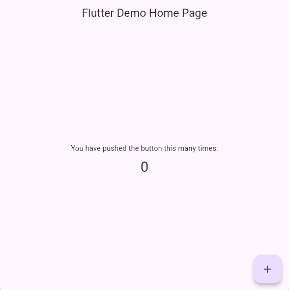
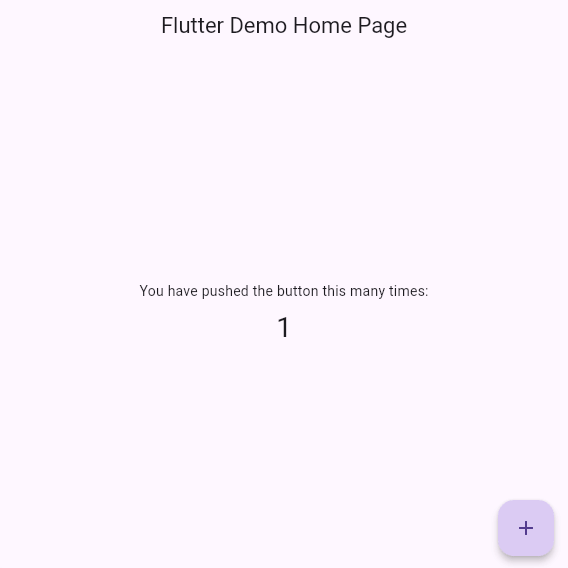
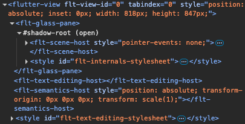
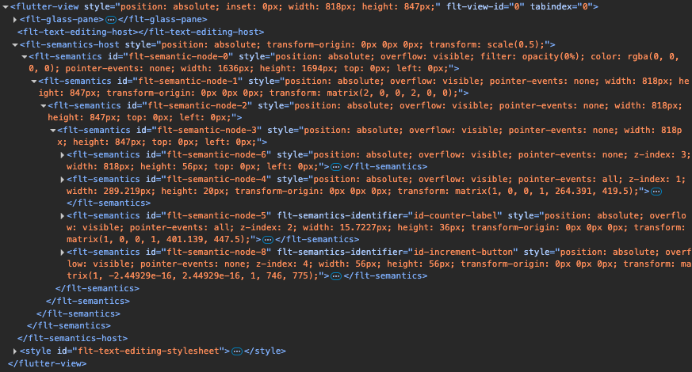
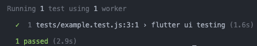

# 25 Testing Flutter Web Apps with Playwright and Semantics

The default Flutter counter app increments a number when the user presses the "+" button:

| Before | After |
| - | - |
|  |  |

How would we test this behavior on the web?

## The Standard Approach

To verify the UI works correctly, we would:
- Assert that "0" is visible initially  
- Tap the "+" button  
- Assert that "1" is visible afterward  

With Flutter, we could run this test in a browser using Integration Tests. In fact, the Flutter documentation already provides a [complete example](https://docs.flutter.dev/testing/integration-tests#test-in-a-web-browser).

## When Integration Tests Are Not Enough

Flutter Integration Tests launch a fresh, instrumented instance of Chrome to run web tests.

This works well for development and CI, but in embedded devices or hardware-constrained environments, starting a new browser is often impossible or impractical. You cannot attach Flutter’s integration test driver to an already running browser, so tests must interact with the browser instance already hosting the app. 

This is where browser automation tools like Playwright become useful.

## The Core Challenge

Most web testing strategies rely on querying DOM elements by Text, Id or Class. 

Flutter Web does not render widgets as traditional HTML elements. Instead, it renders the UI into a `<canvas>` element. As a result, standard DOM selectors cannot find buttons or text nodes.

However, Flutter maintains a semantics tree. When enabled, this tree is exposed as a separate invisible DOM overlay for accessibility tools. This overlay gives us hooks for UI automation.

## Using Semantics for Testability

Semantics provide structured metadata (roles, labels, states) for UI elements, allowing accessibility tools — and automated tests — to identify and interact with widgets reliably.

To add Sematic labels, simple wrap any Flutter widget with the `Semantics` widget and assign a unique identifier:

```dart
Semantics(
  identifier: 'id-counter-label',
  child: Text(
    '$_counter',
    style: Theme.of(context).textTheme.headlineMedium,
  ),
),

Semantics(
  identifier: 'id-increment-button',
  button: true,
  child: FloatingActionButton(
    onPressed: _incrementCounter,
    child: const Icon(Icons.add),
  ),
),
```

By default, the semantics tree exists internally but is not exposed to the DOM for performance reasons. To expose it, call

```dart
SemanticsBinding.instance.ensureSemantics();
```

before `runApp()`. The generated DOM will then include attributes like `flt-semantics-identifier="id-counter-label"` and `flt-semantics-identifier="id-increment-button"`:

| Hidden | Exposed |
| - | - |
|  |  |

These attributes can be used as selectors for automation.

## UI Testing with Playwright

Create a minimal Node project, install `@playwright/test`, and add the following test:

```js
const { test, expect } = require('@playwright/test');

test('flutter ui testing', async ({ page }) => {
  await page.goto('http://localhost:8080');

  // Wait for Flutter to bootstrap and attach the semantics overlay
  await page.waitForSelector('flt-semantics');

  await expect(
    page.locator('[flt-semantics-identifier="id-counter-label"]')
  ).toHaveText('0');

  await page.locator(
    '[flt-semantics-identifier="id-increment-button"]'
  ).click();

  await expect(
    page.locator('[flt-semantics-identifier="id-counter-label"]')
  ).toHaveText('1');
});
```

Firstly run the counter app: 

```sh
flutter build web
cd build/web
http-server
```

and then run the test:

```sh
npx playwright test
```

In the terminal, the test should successfully pass:



For interactive debugging, you can pass the headers `--headed --debug`:

```sh
npx playwright test --headed --debug
```

## Enabling Semantics Conditionally

Semantics introduce a small performance overhead. In production builds, enable them only when necessary via Dart defines:

```sh
flutter build web --dart-define=ENABLE_SEMANTICS=true
```

```dart
void main() {
  const enableSemantics = bool.fromEnvironment('ENABLE_SEMANTICS');

  if (enableSemantics) {
    SemanticsBinding.instance.ensureSemantics();
  }

  runApp(MyApp());
}
```

This keeps production builds optimized while allowing deterministic UI automation in testing environments.

## Maintenance

Relying on the semantics tree for automation carries a higher maintenance cost than standard Flutter Integration Tests:
- Flutter’s semantics tree implementation may change between versions, which can break selectors or require test updates.
- CanvasKit and WebAssembly renderers may behave differently, so tests may occasionally need adjustments.
- Automation requires a separate semantics enabled build specifically for testing.

Despite these considerations, Semantics and Playwright can be a reliable way to test Flutter Web apps on embedded systems.
